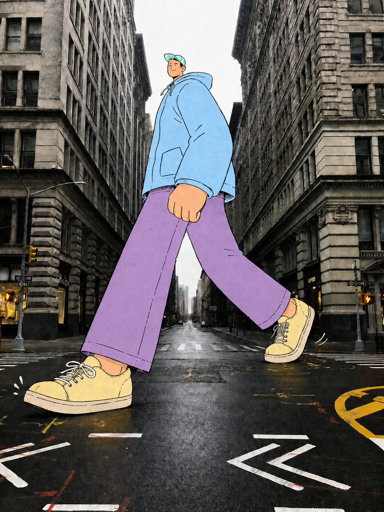
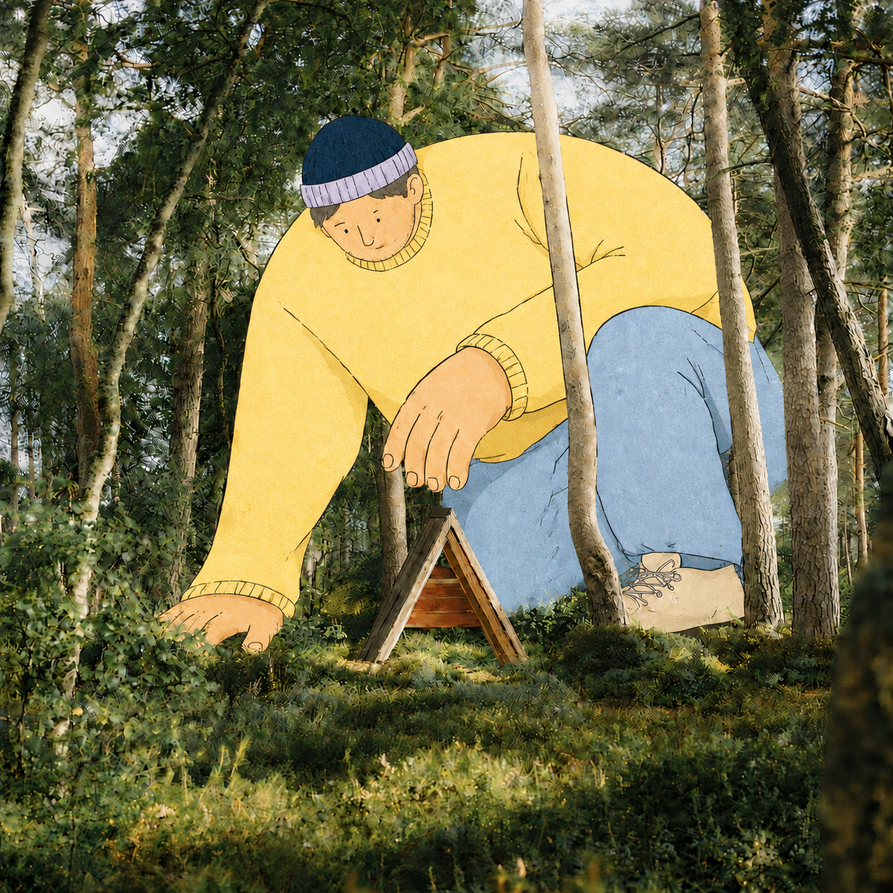
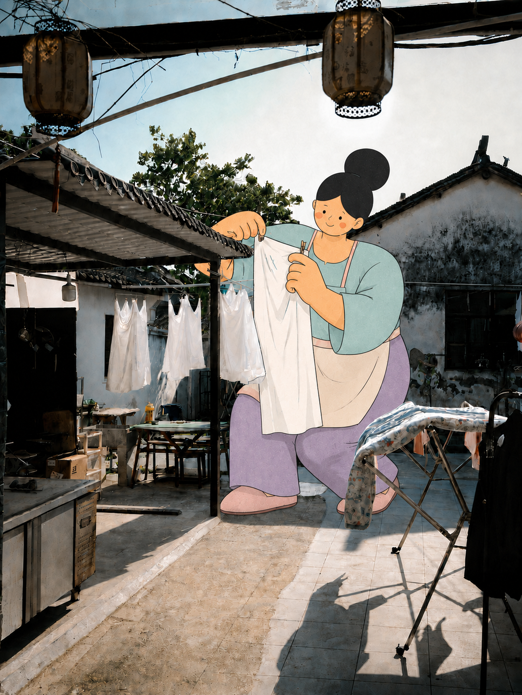

# Real Scene Character Stylizer

把二维手绘角色放进真实照片，让角色与街道、建筑、树木、水面和日常物件发生可信互动。

这个 Codex Skill 保留照片的真实质感，通过接触点、透视、尺度和前后遮挡建立空间关系。它适合街景、建筑、自然风光、交通场景、地标和编辑插画，不用于整张照片重绘或普通写实合成。

## 效果示例

| 城市街道 | 自然场景 | 日常生活 |
| --- | --- | --- |
|  |  |  |

查看全部原图与生成结果：

- [三场景案例](examples/three-scene-case/README.md)：高山湖泊、现代天际线、香港街道
- [四场景案例](examples/four-scene-case/README.md)：雨天城市、阳光巷道、森林小屋、晾衣庭院

案例用于理解构图和质检，不是固定人物模板。每张新照片都应根据自身空间重新设计角色、动作、服装和配色。

## 核心能力

- 分析天气、时间、透视、负空间和视觉情绪。
- 从屋顶、道路、栏杆、树干、车辆、衣物等真实元素中寻找互动锚点。
- 提供适合场景的角色、穿搭、动作、尺度和画面质感选项。
- 区分编辑目标、风格参考和身份参考，避免把参考人物直接复制进照片。
- 用遮挡、接触阴影和透视关系避免“悬浮贴纸感”。
- 在交付前检查肢体、接触点、文字、建筑和照片保真度。

## 安装

将整个仓库复制或克隆到 Codex Skills 目录：

```bash
git clone https://github.com/Nick-Job/real-scene-character-stylizer.git ~/.codex/skills/real-scene-character-stylizer
```

重新启动 Codex 或开启新任务，让 Skill 目录重新加载。

## 使用

上传一张真实照片，然后调用：

```text
使用 $real-scene-character-stylizer 分析这张照片，并给我适合场景的角色与穿搭选项。
```

也可以直接给出方向：

```text
使用 $real-scene-character-stylizer，在这张街景里加入一个跨过马路的二维城市巨人。保留建筑、路牌和车辆。
```

如果没有指定完整细节，Skill 会先提供一组基于照片现场的精简选项。确认角色、动作、位置、尺度和质感后，再调用可用的图片编辑工具生成结果。

## 工作原则

1. **照片是世界。** 保留地点、光线、材质、透视和重要信息。
2. **角色必须回应现场。** 坐、跨、扶、躲、骑、钓或从真实物体后方探出。
3. **遮挡建立空间。** 让车辆、树干、栏杆、屋檐或家具从角色前方经过。
4. **插画保持二维。** 使用清晰轮廓、平涂色块、简化结构和少量手绘颗粒。
5. **参考只提供抽象语言。** 可借鉴色彩层级、线条和质感，不复制姿势、轮廓或服装结构。

完整规则见 [SKILL.md](SKILL.md)。

## 目录结构

```text
real-scene-character-stylizer/
├── SKILL.md                  # 主流程与质量检查
├── agents/openai.yaml        # Codex 显示信息与默认提示词
├── references/               # 视觉体系和场景选项
└── examples/                 # 原图、生成结果与案例复盘
```

## 适用与不适用

适用：真实街景、建筑、自然景观、交通、地标、生活空间，以及摄影与平面插画结合的编辑画面。

不适用：整图动画化、纯文生图、写实人物合成、精确换脸，或要求逐像素无变化的专业修图流程。

## License

仓库暂未声明开源许可证。使用或分发前，请由仓库所有者补充许可证，并确认案例照片的来源授权与署名要求。
