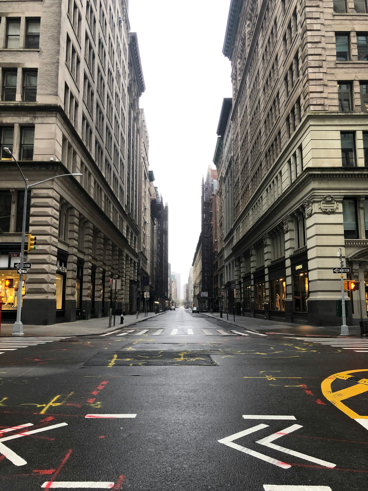
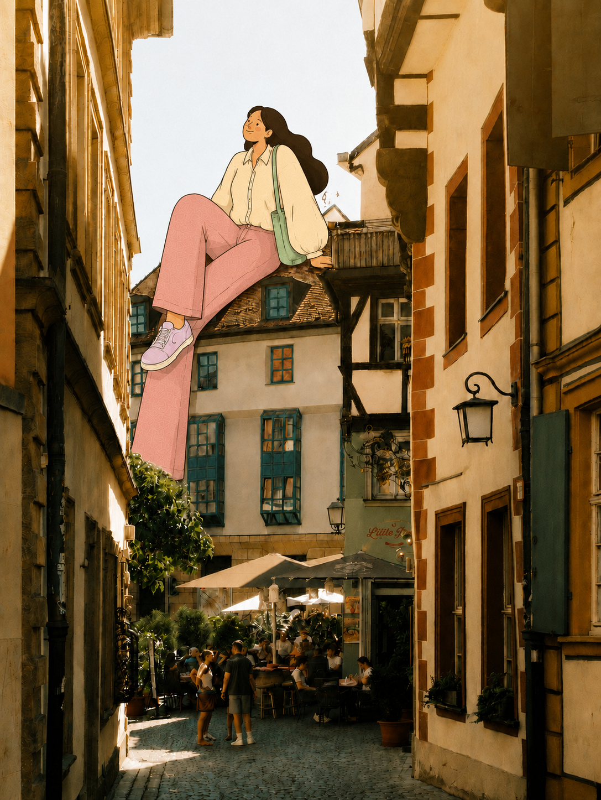
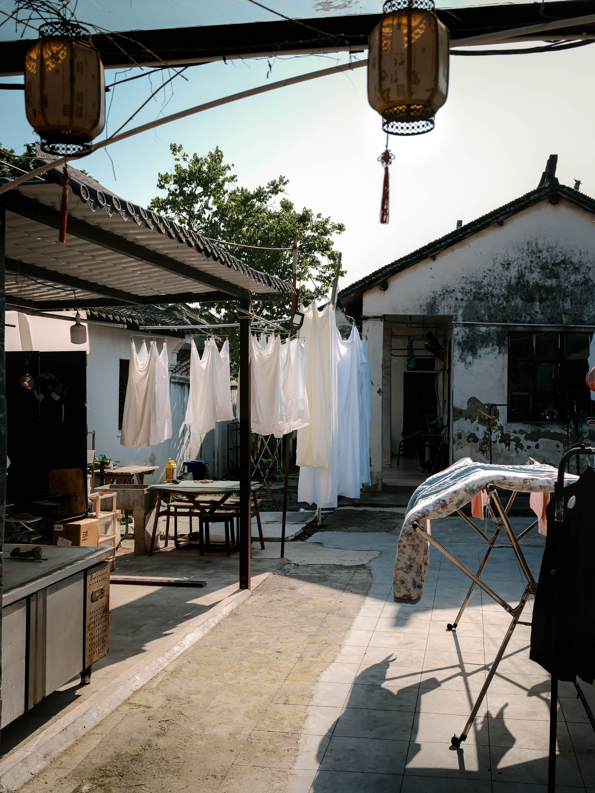

# Four-scene reference case

This set demonstrates how the same real-photo-plus-flat-illustration grammar adapts to four different spatial problems: a deep city street, a warm architectural alley, a layered forest, and a domestic courtyard.

The first four files are edit targets and the second four are their corresponding generated results. Use the outputs for composition and quality review only. Do not copy their characters, silhouettes, poses, clothing blocks, or palettes into a new scene.

## Case 1 — Rainy city walker

| Edit target | Generated result |
| --- | --- |
|  |  |

- **Anchor:** the wet foreground intersection and its white lane markings establish the walking surface.
- **Movement:** a giant left-to-right stride follows the street's central vanishing line.
- **Occlusion:** both shoes remain in front of the street; contact is communicated mainly through sole placement, small motion marks, and a dark ground shadow rather than architecture passing in front.
- **Silhouette and outfit:** compact head, oversized sky-blue hooded jacket, broad purple trousers, pale-yellow sneakers, mint cap.
- **Color hierarchy:** blue dominant, purple secondary, yellow and mint accents, grayscale architecture as breathing space.
- **What works:** the giant is instantly readable, the shoe perspective matches the low camera angle, and the pastel palette separates cleanly from the rainy gray city.
- **Limitation:** this is a strong scale-and-contact example but a weak occlusion example; the figure also dominates the street and reduces the original negative space.

## Case 2 — Sunlit rooftop sitter

| Edit target | Generated result |
| --- | --- |
|  |  |

- **Anchor:** the rear tiled roof becomes a seat while the right-side timber balcony supports one hand.
- **Movement:** the relaxed bent leg and long dangling trouser leg create a vertical path toward the cafe activity below.
- **Occlusion:** the body sits in front of the open sky, while roof edges and the left wall partially interrupt the lower silhouette.
- **Silhouette and outfit:** long dark hair, loose cream blouse, wide dusty-pink trousers, lavender sneakers, slim sage shoulder bag.
- **Color hierarchy:** cream dominant, dusty pink secondary, lavender and sage accents, warm ochre architecture as the common ground.
- **What works:** pose, sunlight, clothing, and architecture share a quiet leisure mood; the human activity below remains recognizable and supplies scale.
- **Limitation:** the giant covers several windows and relies more on overlap than on convincing front/behind weaving; preserve more façade detail when architecture is the subject.

## Case 3 — Forest caretaker

| Edit target | Generated result |
| --- | --- |
|  |  |

- **Anchor:** the small A-frame shelter is the focal prop; the forest floor supports the crouching figure.
- **Movement:** the giant bends downward, reaching one hand into the undergrowth while visually protecting or inspecting the shelter.
- **Occlusion:** multiple real tree trunks pass in front of the torso and trousers; foreground foliage also hides part of the reaching hand and shoes.
- **Silhouette and outfit:** broad rounded yellow sweater, loose pale-blue trousers, cream boots, navy knit cap with a lavender band.
- **Color hierarchy:** yellow dominant, pale blue secondary, navy/lavender accents, dense green forest as breathing space.
- **What works:** this is the strongest multi-layer occlusion example in the collection. The real trunks split the flat silhouette and convincingly place the giant inside the woods.
- **Limitation:** the figure nearly fills the upper frame and can overpower the shelter; use a smaller scale for a quieter companion vignette.

## Case 4 — Laundry helper

| Edit target | Generated result |
| --- | --- |
|  |  |

- **Anchor:** the clothesline, white garments, clothespins, and tiled courtyard turn an existing household activity into the narrative.
- **Movement:** both hands hold and pin a real-scale white shirt, concentrating attention around a believable task.
- **Occlusion:** the foreground ironing board passes in front of the lower body, while existing hanging fabric and poles layer around the figure.
- **Silhouette and outfit:** rounded body, large bun, cropped pale-aqua top, cream apron, lavender trousers, soft pink shoes.
- **Color hierarchy:** pale aqua dominant, cream secondary, lavender and blush accents, black-white courtyard structures as breathing space.
- **What works:** the character does not merely occupy empty space; hands, clothespin, shirt, clothesline, and foreground furniture all participate in the story.
- **Limitation:** the generated shirt replaces or reconstructs part of the original laundry arrangement, so use stricter preservation language when individual garments must remain pixel-faithful.

## Lessons to transfer

1. Empty sky is useful for a silhouette, but environmental contact must still come from a roof, street, tree, line, or prop.
2. Ground contact alone can establish scale, but an object passing in front of the character creates a stronger sense of inhabiting the photograph.
3. Dense scenes benefit from activity-based interactions: pinning laundry, holding a rail, tending a shelter, or sitting on a roof.
4. Real tree trunks, poles, railings, furniture, and vehicles are effective occluders because their edges are easy to read.
5. Match role and clothing to the scene's emotional temperature: cool pastels for rainy urban space, warm muted colors for a sunny alley, bright simple masses for dense foliage.
6. Check what the character covers. A successful giant can still erase architecture, people, or negative space that the photograph needs.
7. Generated edits may reconstruct source details. When exact preservation matters, repeat invariants for faces, text, garments, signs, and landmark edges.
