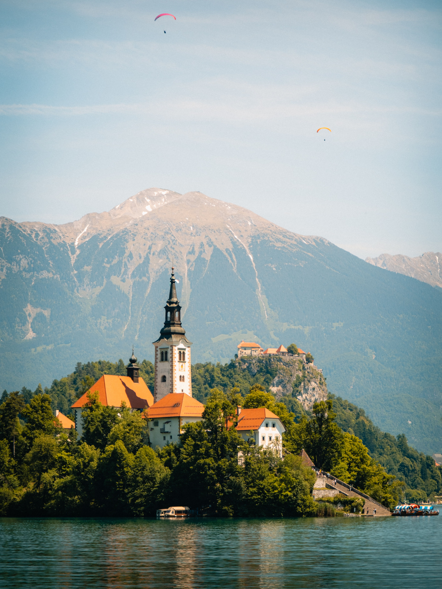
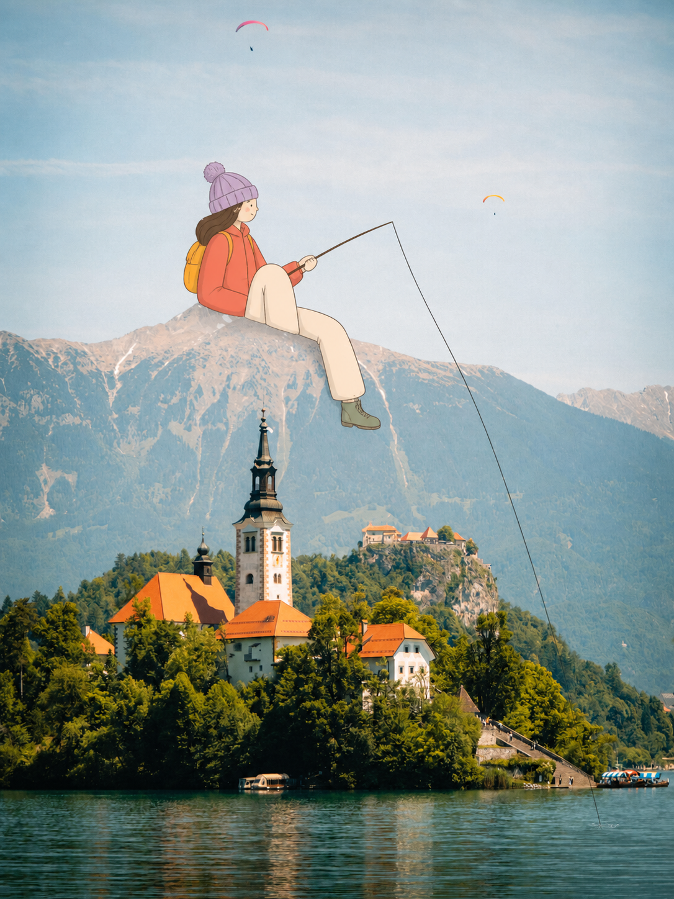
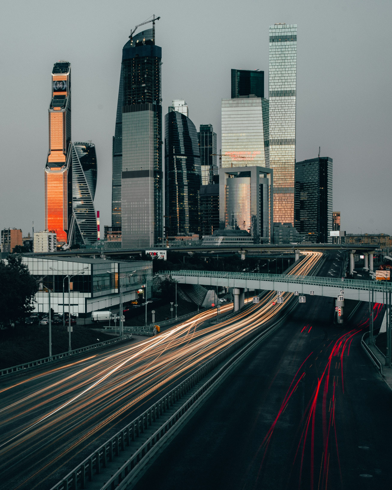
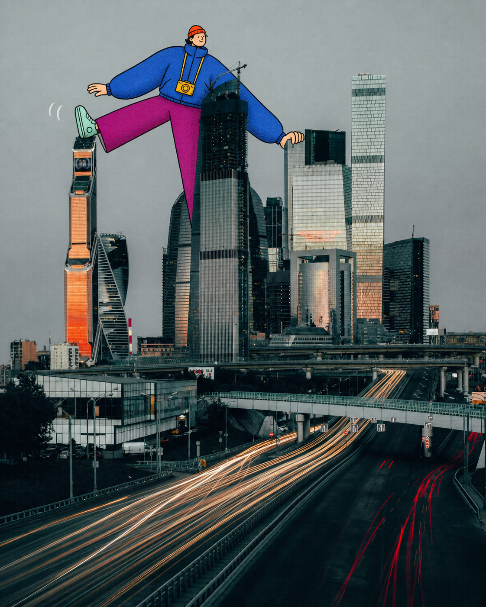
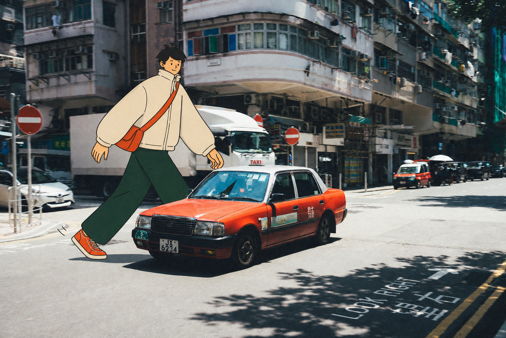

# Three-scene reference case

Use this case to calibrate scene-specific character design, environmental contact, and occlusion. It demonstrates three independent interventions rather than a coordinated character series.

These outputs are references for reasoning and quality review, not templates to trace. Design a new character for every new edit target; do not copy these silhouettes, outfits, poses, or fixed palettes.

## Case 1 — Alpine lake dreamer

| Edit target | Generated result |
| --- | --- |
|  |  |

- **Anchor:** the central mountain ridge acts as a seat; the lake receives the fishing line.
- **Movement:** a quiet diagonal from the seated figure through the rod to the water.
- **Occlusion:** the ridge hides part of the hips; the character overlaps the mountain but leaves the church, castle, and paragliders readable.
- **New silhouette and outfit:** compact head, coral windbreaker, cream trousers, lavender knit cap, sage boots, mustard backpack.
- **Color hierarchy:** coral dominant, cream secondary, lavender and mustard accents, pale-blue photographic breathing space.
- **What works:** the exaggerated scale reads immediately, the ridge supplies believable support, and the sparse intervention preserves the travel photograph.
- **Limitation:** the fishing line does not pass behind the church tower as originally directed, so it demonstrates useful contact and scale but not a strong front/behind architectural occlusion.

## Case 2 — City skyline giant

| Edit target | Generated result |
| --- | --- |
|  |  |

- **Anchors:** the orange-lit tower supports one shoe; the dark central tower hides part of the crossing leg; a mid-height roof receives one hand.
- **Movement:** a broad left-to-right stride echoes the highway diagonals below.
- **Occlusion:** the central building passes in front of the magenta trouser leg, making the giant inhabit the skyline rather than float over it.
- **New silhouette and outfit:** compact head, oversized cobalt puffer, long magenta trousers, mint high-tops, orange beanie, yellow camera.
- **Color hierarchy:** cobalt dominant, magenta secondary, orange/yellow accents, gray sky and charcoal buildings as breathing space.
- **What works:** multiple architectural contacts, strong thumbnail silhouette, and high color contrast against the overcast city.
- **Limitation:** the pose is intentionally poster-like and dominates the skyline; use a smaller scale when landmark recognition is the priority.

## Case 3 — Hong Kong urban courier

| Edit target | Generated result |
| --- | --- |
|  |  |

- **Anchor:** the road is the walking surface and the foreground taxi is the principal depth cue.
- **Movement:** a left-to-right stride follows the taxi and the street perspective.
- **Occlusion:** the real taxi covers the near leg, while the visible shoe lands on the road with a small contact shadow.
- **New silhouette and outfit:** short dark hair, oversized cream jacket, forest-green wide trousers, orange sneakers, vermilion messenger bag.
- **Color hierarchy:** cream dominant, forest green secondary, orange/vermilion accent, gray-blue street as breathing space.
- **What works:** the taxi creates a convincing photographic foreground, and the flat character remains instantly distinct from the motion-blurred scene.
- **Limitation:** the result reads as a relaxed step rather than a fast courier stride, and generative editing slightly reconstructs photographic details instead of preserving every source pixel.

## Lessons to transfer

1. Choose the real anchor before designing the character.
2. Use at least one meaningful occlusion whenever the scene offers an object that can pass in front of the drawing.
3. Let line of action follow a strong photographic direction: ridge, road, skyline, rail, shoreline, or light trail.
4. Design each scene independently; variation in scale, silhouette, role, clothing, and palette prevents a batch from feeling stamped out.
5. Treat generated examples critically. A visually appealing output may still miss a requested occlusion or motion cue.
6. Preserve landmark identity and photographic breathing room; the character should change the story without replacing the place.
